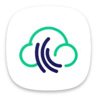

<p align="center"></p>


<div align="center">

[](https://github.com/moha-b/clima)
[](https://github.com/moha-b/clima)

</div>

# Clima 🌤️
Clima is a user-friendly weather app designed to provide you with almost accurate and up-to-date weather information in the simplest way possible. With Clima, you can easily check the current temperature in your location for today and the next six days, allowing you to plan your activities accordingly. The app also offers detailed hourly forecasts, providing you with weather updates every three hours throughout the day.  Say goodbye to complicated interfaces and overwhelming data—Clima focuses on delivering essential weather information, making it the go-to choice for anyone seeking a straightforward and reliable weather app.

## Installation Instructions: 💣
Before you start, you'll need to obtain API keys from the following services:

- **Google Maps API Key:**
    - Visit the [Google Cloud Console](https://console.cloud.google.com/).
    - Create a new project and enable the Google Maps API.
    - Generate an API key and restrict its usage as needed.
    - To integrate the map with your project, follow the [Configuration](https://pub.dev/packages/google_maps_flutterw)
- **~~OpenWeather API Key:~~** 
    - ~~Go to the [OpenWeather website](https://openweathermap.org/).~~
    - ~~Sign up for a free account and generate an API key.~~
- **Open-Meteo API**
  - Go to the [Open-Meteo website](https://open-meteo.com/).
  - You don't need to sign up because this api don't have `api key`
  - Check whatever end point you need from the [Documentation](https://open-meteo.com/en/docs/)
- **News API Key:**
  - Go to the [NewsAPI website](https://newsapi.org/).
  - Sign up for a free account and generate an API key.
> Due to insufficient data, the `OpenWeather` API is unable to provide the required information. However, the `Open-Meteo` API offers a variety of options to choose from.


### Setting Up API Keys `[ Important ]`
Let's start with setting up the APIs in your project. We can begin with **Clima** and then move on to other approaches.

To begin with, we need to define the API keys using this command.
```shell
flutter run --dart-define=YOUR_API_KEY=API_KEY_VALUE --dart-define=YOUR_API_KEY=API_KEY_VALUE
```
then we can get these values in your Dart code like this in a [EnvHelper](lib/core/helper/env_helper.dart). 
And use this class as your Environment specific config all over the project.
```dart
abstract class EnvHelper {
  static const GOOGLE_MAPS_API = String.fromEnvironment('GOOGLE_MAPS_API');
  static const NEWS_API_KEY = String.fromEnvironment('NEWS_API_KEY');
}
```
**Android configuration**

To make the necessary changes, please navigate to your app module's Gradle file and add the provided code.
```groovy
def dartEnv = [
        GOOGLE_MAPS_API: '', // leave it like this 
        NEWS_API_KEY: ''    // it have to be empty
];
if (project.hasProperty('dart-defines')) {
  dartEnv = dartEnv + project.property('dart-defines')
          .split(',')
          .collectEntries { entry ->
            def pair = new String(entry.decodeBase64(), 'UTF-8').split('=')
            [(pair.first()): pair.last()]
          }
}
```
**iOS configuration**

I didn't make it 🙂

**Other Approaches**

1. Clone the repository to your local machine:
```bash
git clone https://github.com/your-username/your-project.git
cd your-project
```
2. In the project directory, create a new file named `.env` to store your API keys:
```
# .env file
GOOGLE_MAPS_API_KEY=your-google-maps-api-key
NEWS_API_KEY=your-news-api-key
```
3. Save the .env file in the root of your Flutter project directory.

**OR**

do what I did, create a dart class containes the keys and add it to `.gitignore` like this :
```dart
class Api {
  static const String key = "your-openweather-api-key";
  static const String googleKey = "your-google-maps-api-key";
}
```

### Running the Flutter Project
Now that you have set up your API keys, you can run the Flutter project on your local machine. Make sure you have Flutter installed. If not, you can follow the official Flutter installation guide.
1. Install project dependencies:
```dart
flutter pub get
```

2. Run the Flutter project:
```dart
flutter run
```
This will launch the Flutter app, allowing you to utilize Google Maps and OpenWeather services within your project.

> **Note**
> Make sure to add the .env file to your `.gitignore` to keep your API keys private and not expose them in your version control system. This ensures the security of your API keys.


## Features ✨
- Current Weather: View the real-time weather conditions for your current location, including temperature, date, and weather description.

- 6-Day Forecast: Plan your week ahead with a 6-day weather forecast. Get insights into the upcoming weather trends, helping you make informed decisions.

- Hourly Updates: Access detailed hourly forecasts, providing weather updates every 3 hours throughout the day. Stay prepared for changing weather conditions.

- Google Maps Integration: Seamlessly integrate Google Maps functionality into the app. Visualize weather data on an interactive map, allowing users to explore different locations.

- Notifications: Receive daily weather notifications to stay informed about significant weather changes. Customize notification preferences for specific weather conditions or time intervals.

- User-Friendly Interface: Experience the simplicity of design. Clima features an intuitive and minimalistic interface, ensuring effortless navigation and quick access to weather information.

- Responsive Design: Enjoy consistent user experience across various devices and screen sizes, including smartphones and tablets.

## Preview 📱

https://github.com/moha-b/Clima/assets/73842931/57eac14e-1714-4a93-a410-056fd524ba3c


## Techniques 🛠️
- Minimum SDK level 21
- Compile SDK Version 34
- Font : Manrope
- Architecture : Mvvm
- Dio 
    - A powerful and easy-to-use HTTP client for Flutter and Dart.
- Permission Handler 
    - Flutter plugin for managing permissions on both Android and iOS platforms.
- Geolocator 
    - A Flutter geolocation plugin for Android and iOS, providing easy access to device location services such as GPS and Network.
- Dartz 
    - A functional programming library for Dart and Flutter, offering tools for handling immutable data, errors, and functional programming concepts.
- Flutter Bloc 
    - A predictable state management library that helps implement the BLoC pattern in Flutter applications.
- Get It 
    - A simple Service Locator for Dart and Flutter projects, providing a convenient way to manage and access objects throughout the app.
- Lottie:
    - A Flutter package for displaying animations created with Lottie, a library for Android, iOS, and the web that parses Adobe After Effects animations.
- Iconsax:
    - A collection of high-quality and customizable icons for Flutter projects, offering a wide range of icons to enhance the app's visual appeal.
- Flutter Local Notifications:
    - A Flutter plugin for displaying local notifications on Android and iOS devices. Useful for scheduling and managing notifications within the app.
- Path Provider:
    - A Dart library for retrieving commonly used locations on the filesystem, such as temporary and application-specific directories.
- Equatable:
    - A Dart package that helps in comparing objects for equality in a more convenient way, enhancing the simplicity of value-based equality checks.
- Flutter SVG:
    - An SVG rendering and widget library for Flutter, enabling the display of Scalable Vector Graphics files in Flutter applications.
- Wakelock Plus:
    - Allows you to keep the device screen awake, i.e. prevent the screen from sleeping.
- Google Maps Flutter:
    - A Flutter plugin for integrating Google Maps into Flutter applications, allowing developers to display interactive maps with markers, polylines, and more.


## Contribution Guidelines 🚀
We appreciate your interest in contributing to Clima! Before you start, please take a moment to read our [Contribution Guidelines](.github/CONTRIBUTING.md) for details on how to contribute, code of conduct, and other important information.

Thank you for contributing to Clima! 🌦️
